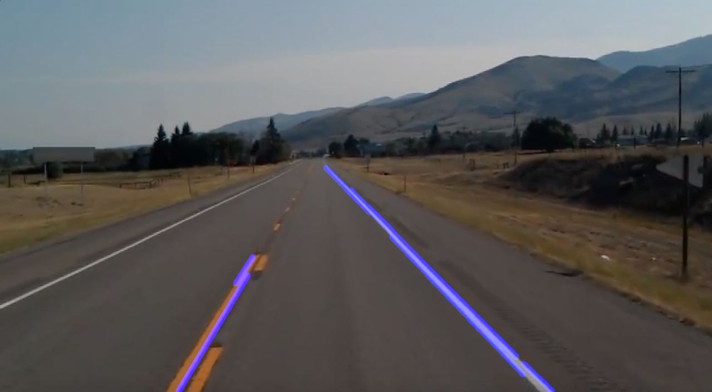

<h1>Lane Detection</h1>

Lane detection is a computer vision task that aims to identify boundary of road lanes in a video or an Image. It is crucial for navigation and safety in the domain of ADAS and Autonomous vehicles. 

In this project, the simulation is carried out using an Image and a Video. 

<h2> Idea behind the execution </h2>

 Identify the lanes on the road through edge detection technique. 

 Separate them out of the whole image or video frame by masking the region of interest with a polygon. 

 Track the lane in the masked region using Hough Transform technique. 

<h2>Concepts involved</h2>

<h3>Edge Detection - Canny edge detector [2]</h3>

 An edge can be characterised based on the change in the intensity values between neighbouring pixels. This change is to be observed in both x-direction and y-direction. 

 In this project, Canny edge detector is used to detect edges in an image or a video frame. 

 The Canny edge detector involves 3 main steps in addition to reducing noise in the image. Reducing the noise helps us to filter out fluctuations between the pixel intensity. A Gaussian filter is used to filter out the noise in the image. With this, fluctuations among intensity values are regulated without losing the information that is necessary to detect an edge. 

<h4>Calculating the Intensity Gradient of the image </h4>

 A Sobel kernel is slided across the blurred image horizontally and vertically to calculate the magnitude and direction of intensity gradient values. 

<h4> Sobel edge detector </h4>

 The Sobel operator detects edges by considering the change in the intensity values between the neighbouring pixels. When the kernel is slided horizontally, the change in intensity across the y-axis is calculated and similar fashion is observed for x-axis direction. An edge is considered if the change or gradient in the intensity values is greather than certain threshold value. Usually, 3X3 kernel is applied across the image to calculate edges. 

<h4>Suppression of False edges </h4>

 Applying Sobel kernel provides the information of possible edge occurences. Sometimes, there can be false positives in these results. Hence, each pixel from the results is compared with intensity of neighbouring pixels in the positive and negative gradient direction. If the magnitude of gradient of current pixel is greater than its neighbouring one, the pixel is left unchanged. Else, the gradient magnitude is set to zero. This can significantly reduce the possibility of occurences of edges by holding pixels with high confidence. 

<h4>Hysteresis Thresholding </h4>

In this step, the gradient for the existing pixels is compared with two thresholds i.e. minimum and a maximum values. If the gradient is lower than the threshold value, the pixel is directly excluded from the final edge map. However, if the gradient is higher than the maximum threshold, the pixel is considered as an edge pixel. 

 For the pixels whose gradient lies in the range: these are considered as weak gradients. If these weak gradients tag along with strong gradients, then these weak gradients are also considered for the final edge map. Else, pixels with weak gradients are removed out of the final edge map list. 

<h3>Hough Transform [3]</h3>

 Hough transform is a popular technique in computer vision domain to track geometric shapes like lines, circles and other curves. Its applications vary across different fields such as medical imaging, robotics and Autonomous Driving. 

 It is a feature extraction method to find basic geometric structures. Basically, it transfers the geometric structures from spatial domain to parameter space. Parameters in spatial domain such as slope and intercept are converted to Hough space that calculates a curve with parameters distance and angle. It calculates the matching curves at each edge point in the image. This is accomplished by finding the curve that intersects the parameter value at the spot by iterating over all possible values of the parameters. 

 The intersections of each combination of parameters which can be considered as votes are recorded by accumulator array to identify the shape. 
 

<h2>Results</h2>

The below pictures and video show that the lanes of the road being detected and highlighted with blue lines

  
   

https://github.com/user-attachments/assets/d8d8ab34-16c6-4fb2-8342-b14440af6064

<h2> Limitations </h2>

 The ROI (region of interest) created is specific to the image and not adaptable. Roads of smaller size or larger size may face unforeseen issues.  

 Few edges may be missed because of rigid threshold values. Example: Edges may be missed in case of poor visibility. 

<h2>References</h2>

<ol>
  
<li>The complete Self-Driving Car course - Applied Deep Learning from Udemy https://www.udemy.com/share/101X5w3@pa0anYic8egmzZJU4rBrLm74cKSLBQpNXOWg0JCemRZWhTfFVLCsnwXVft6GWP-CTA==/</li>

<li> L. Team and L. Team, “Edge Detection using OpenCV | LearnOpenCV #,” LearnOpenCV – Learn OpenCV, PyTorch, Keras, Tensorflow With Code, & Tutorials, Feb. 05, 2024. Available: https://learnopencv.com/edge-detection-using-opencv/ </li>

<li> GeeksforGeeks, “Hough transform in computer vision.,” GeeksforGeeks, Jun. 17, 2024. Available: https://www.geeksforgeeks.org/hough-transform-in-computer-vision/ </li>

</ol>

<h3>Disclaimer</h3>

The knowledge of this mini-project is acquired from reference [1].

The above information and results added to this project do not hold any intention of misusing the references. The above information and results are added to my GitHub account solely to prove that I hold hands-on experience in these concepts. I request viewers not to misuse the above information and not to share this data with any person or media.

