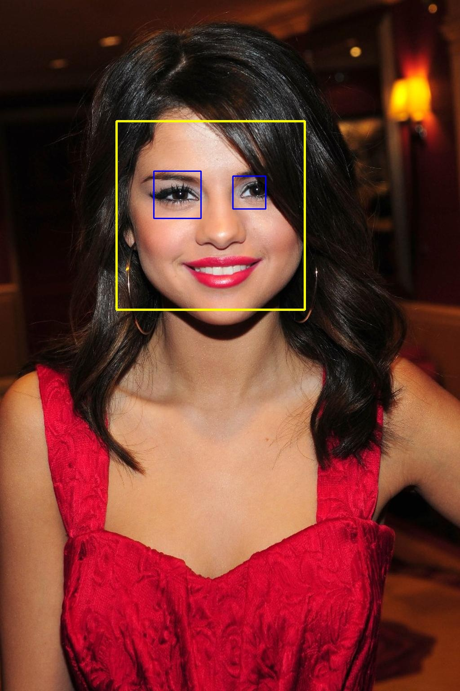
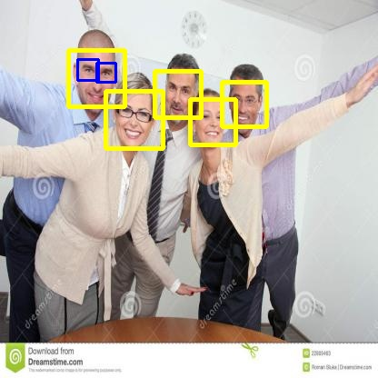

<h1>Face Detection using Viola - Jones algorithm</h1>

This project aims to detect human faces in the given images. 

This folder contains code along with example images for Face detection using Haar cascade for the frontal face. 

<h2>Introduction</h2>

Face detection is a computer vision technology that is used to detect the presence of a Human face in a database of images or a sequence of image frames in a video. 

This is the foremost and basic step in many applications ranging from Face Recognition to security surveillance tasks. 

A Lightweight model following the Viola - Jones Algorithm is developed in this project that can detect the presence of a Human's frontal face. 

A Few observations regarding some limitations that affect the accuracy in predicting the location of Human faces are shared in this project. 

<h2>Viola - Jones Algorithm</h2>

This algorithm was introduced by Paul Viola and Michael Jones in 2001. This algorithm is widely utilized in real-time applications because of its simplicity and efficiency. The algorithm goes through three individual steps to locate the presence of a human face. 

<h3>Features and Integral Image</h3>

Certain characteristics of the Human face make it possible to detect and separate it from the rest of the image. Haar-like patterns are used to identify these facial characteristics. Haar-like patterns are 2-4 grouped black and white rectangles that create a certain pattern of kernel which slides over the image for edge detection. An integral image is created by this kernel and the difference between the sum of pixel intensity values covered by the white rectangle and the sum of pixel intensity values is compared to a threshold. This comparison enables kernel to propose the presence of a face.

Generally greyed image is considered for face detection and it is reduced to 24x24 size for efficient computation. These Haar features are slid over 12 different scales of the input image.

<h3>Feature selection with AdaBoost</h3>

Generally, these features are considered weak classifiers with no expectations of providing a successful classification. Hence, AdaBoost procedure is followed in this algorithm. In this method, a small set of best classifiers with significant varieties are considered.

In this AdaBoost procedure, a single classifier can be considered as one rectangle feature that best separates negative and positive samples. During training, these classifiers yield an error rate of 0.1 - 0.3 but yield an error rate of 0.4 - 0.5 at later stages.

<h3>Attention Cascade</h3>

The proposal for the presence of a face feature is determined by comparison with the threshold value. Lower the threshold value -> More the detections -> But can lead to more false positives. At the same time, higher the threshold value -> Low number of detections -> may miss the true detections. 

To overcome this issue, the weak classifiers are trained per distinctive feature and are combined to form a strong classifier. The sub-window of the input images is processed through this cascade. It gets dropped if any of the classifiers in this cascade does not detect information that belongs to the Human face. 

<h2>Results and Observations</h2>

The dataset used for this project is <b>Face Detection DataBase</b> (FDDB) from ref [2].

The below figures show that the model detected the location of the human face and eyes successfully and added rectangles around the regions of interest

  
   

However, the model's accuracy could be affected by many other factors. In the below comparison, the model could predict faces but its performance is degraded in the case of eye detection.

  
   

<i>Note: The comparison for other images is left for self-analysis</i>

<h2>Limitations</h2>

<ul>
  
<li>Despite being lightweight and real-time efficient, this model is highly susceptible to extreme contrast conditions.</li>

<li>It is limited to the detection of only frontal faces.</li>

<li>This algorithm is associated with a high false positive rate.</li>

</ul>

<h2>References</h2>

<ol>
  
<li>Viola, P., Jones, M.J. Robust Real-Time Face Detection. International Journal of Computer Vision 57, 137–154 (2004). https://doi.org/10.1023/B:VISI.0000013087.49260.fb</li>

<li>“Face detection Object Detection Dataset (v1, FDDB) by FDDB,” Roboflow. https://universe.roboflow.com/fddb/face-detection-40nq0/dataset/1</li>

</ol>
